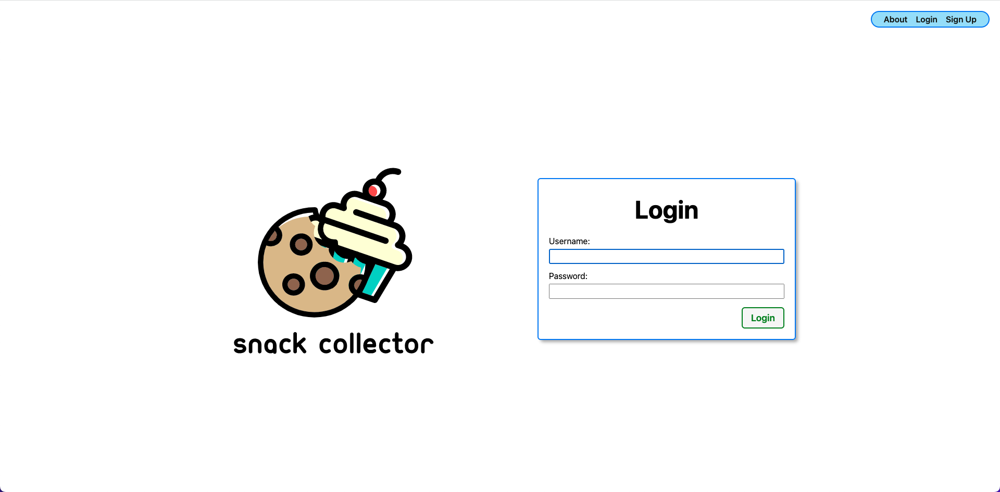
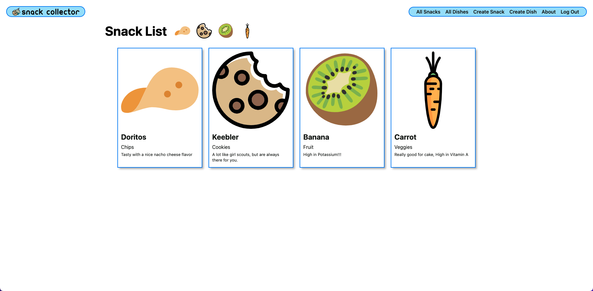

# Snack Collector
Snack Collector allows users to add their own snacks, along with purchase dates tracking and shared dishes between snacks.
The app uses Django for functions including authentication. It also utilizes Postgres for the database. 
## Getting Started
### Deployed App
This app is deployed using heroku and can be used [here](https://snack-collector.herokuapp.com/)
### Functions/Navigation
- All Snacks: This is an indexed view of all the user's created snacks on the database. Each card of the snack includes the title, type, and description.
  - Each snack leads to a detailed view which has a list of purchase dates and dish options for the snack, in addition to the information from the card.
- All Dishes: This is similar to the snacks view, but only contains the title for the dish.
  - Each "Index" view has a linked detail page for each item that includes more information
- Create Snack/Create Dish: These are both similar pages for the creation of their respective resource.
- About: Just a simple about page

The app also includes Django authentication for page views and resources
## Screenshots
Included in this section are a few screenshots of the application.
### Home Page for logged-out User

### Index View for Snacks

## Technologies Used
- Programming Languages - Python
- Database - PostgreSQL
- Frameworks - Django
